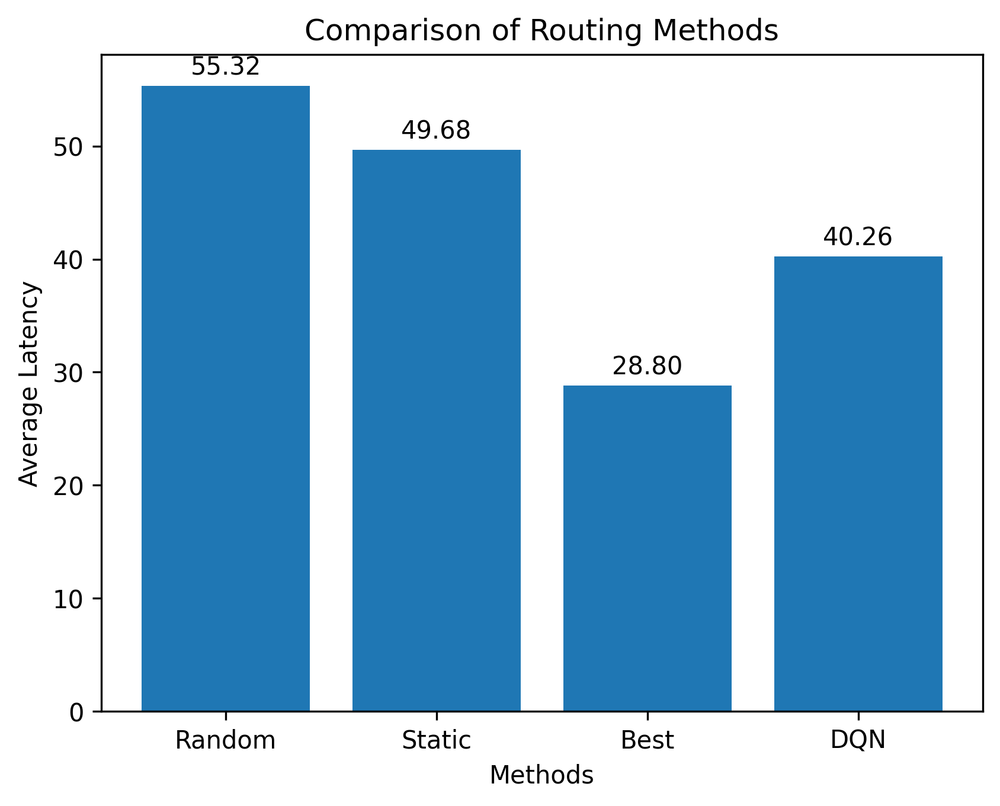
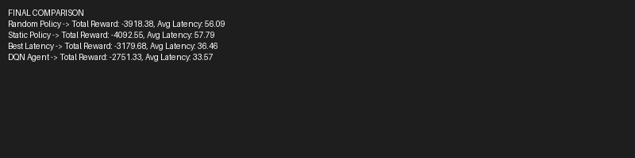

# 🚀 Network Traffic Load Balancer using Reinforcement Learning

## 📌 Overview
This project implements a Reinforcement Learning (RL) agent to solve network traffic routing problems. The goal is to minimize latency by intelligently selecting optimal paths.

---

## 🧠 Problem Description
Traditional routing methods like static or random policies fail to adapt to dynamic network conditions. This project uses a Deep Q-Network (DQN) agent to learn better routing strategies.

---

## ⚙️ Environment
- Custom network simulation environment
- State: latency values of available paths
- Action: select a routing path
- Reward: negative latency (lower is better)

---

## 🧪 Implemented Methods
- 🎲 Random Policy
- 📌 Static Policy
- ⚡ Best Latency Heuristic
- 🤖 DQN Agent (Reinforcement Learning)

---

## 📊 Results

### Final Average Latency:
- Random Policy: **55.32**
- Static Policy: **49.68**
- Best Heuristic: **28.80**
- DQN Agent: **40.26**

---

## 📈 Visualization



---

## 📸 Training Output



---

## 🔍 Analysis
The DQN agent successfully improves performance compared to random and static policies. However, the heuristic method achieves the lowest latency due to direct optimal selection.

---

## ▶️ How to Run

```bash
pip install -r requirements.txt
python train.py
python plot.py

---

## 📁 Project Structure

---

network-traffic-load-balancer-rl/
│
├── env.py
├── dqn_agent.py
├── train.py
├── evaluate.py
├── utils.py
│
├── results/
│ ├── final_results.png
│ ├── terminal_output.png
│
├── images/
│
├── requirements.txt
├── .gitignore
└── README.md